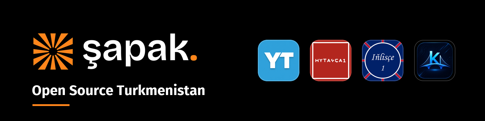

# Hello

[Shapak-Apps][org site] is an open-source organization from Turkmenistan. We build software for people who speak Turkmen: language courses, translators, and small tools. Everything we release is free, works offline, and has no ads.

Most of our contributors are students opening their first pull request. We split issues into small pieces and review code in Turkmen, so weak English is not a blocker here.

[Want to write code with us? Start here][good first issues] 👋

## Ykjam Terjime

Our most used project is [Ykjam Terjime][ykjam site] — a Turkmen phrasebook and translator with 31 languages. It works fully offline and it is free on both stores.

- [Website][ykjam site] 🌐
- [App Store][app store] 📱
- [Google Play][google play] 🤖
- [GitHub][ykjam repo] 💻

[org site]: <https://shapak-apps.github.io/>
[good first issues]: <https://github.com/search?q=org%3AShapak-Apps+is%3Aissue+is%3Aopen+label%3A%22good+first+issue%22&type=issues>
[ykjam site]: <https://shapak-apps.github.io/ykjam-terjime/>
[app store]: <https://apps.apple.com/app/ykjam-terjime/id6758071845>
[google play]: <https://play.google.com/store/apps/details?id=com.shapak.translator>
[ykjam repo]: <https://github.com/Shapak-Apps/turkmen-phrasebook>
